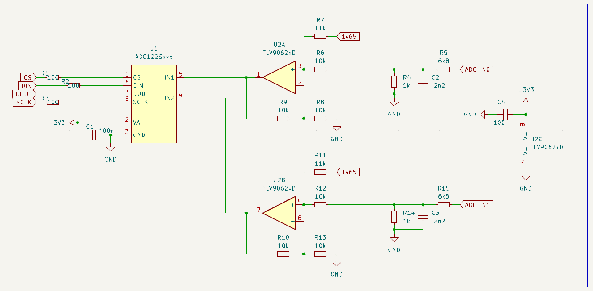
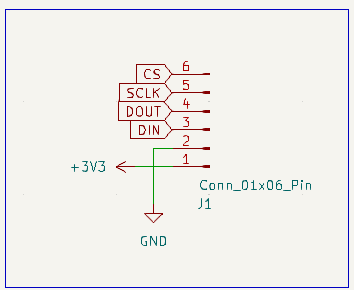
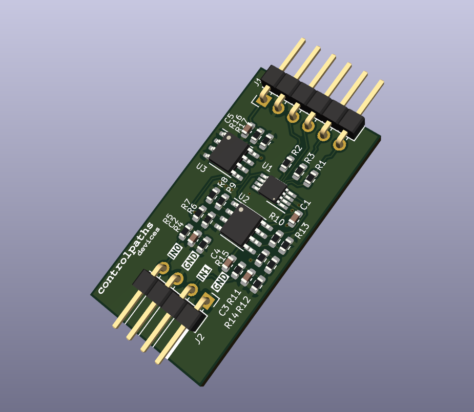
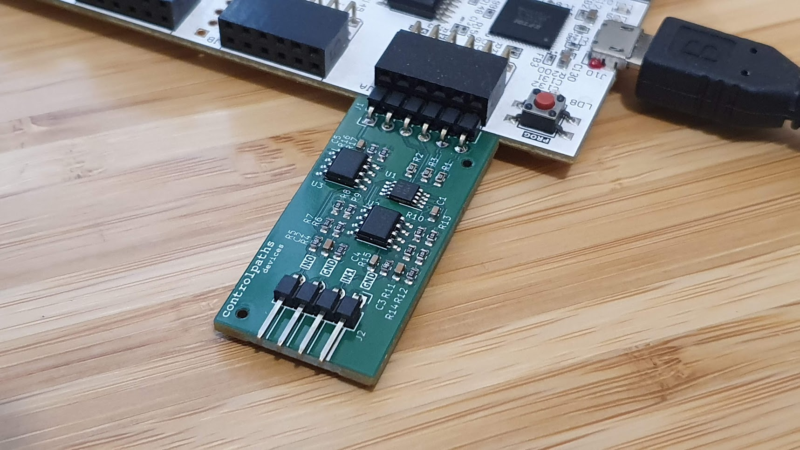
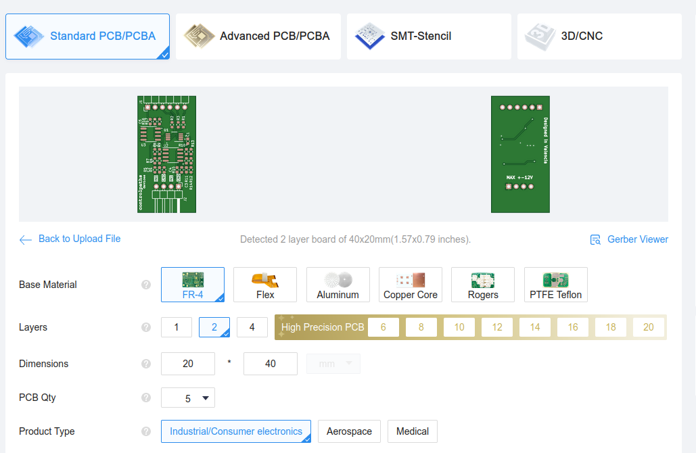

# PMOD ADC12

PMOD with an ADC and an analog circuit to read signals up to +-12V. The PMOD uses the ADC [ADC122S021](https://www.ti.com/lit/ds/symlink/adc122s021.pdf?ts=1709486131740&ref_url=https%253A%252F%252Fwww.google.com%252F) from TI.

To read negative signals, the analog circuit inserts an offset voltage before the signal in connected to the ADC. This offset is always VCC/2. 

In addition, a first-order low pass filter is added in both input channels.

## PMOD interface

This PMOD uses an SPI interface to read the ADC. The pinout of the board is shown in the next image.

The SPi connection is different than the PMOD SPI standard.

## Images

## Get Yours

The PMOD ADC12 is open-source, so you can use the output files to manufacture your own in [JLCPCB](https://jlcpcb.com/?from=controlpath). You just need to compress the `output_files` directory, and upload it to [JLCPCB](https://jlcpcb.com/?from=controlpath). 

Remember to change the Surface Finish to **LeadFree HASL** to make your board ROHS compliant.

Then you have to add the PCB Assembly service and upload the [centroid](./kicad/output_files/pmod_adc12-all-pos.csv) file, and the [BOM](./kicad/output_files/bom.csv). 

In a few days, you will receive your board at home. If you want just one PMOD ADC12, contact me.